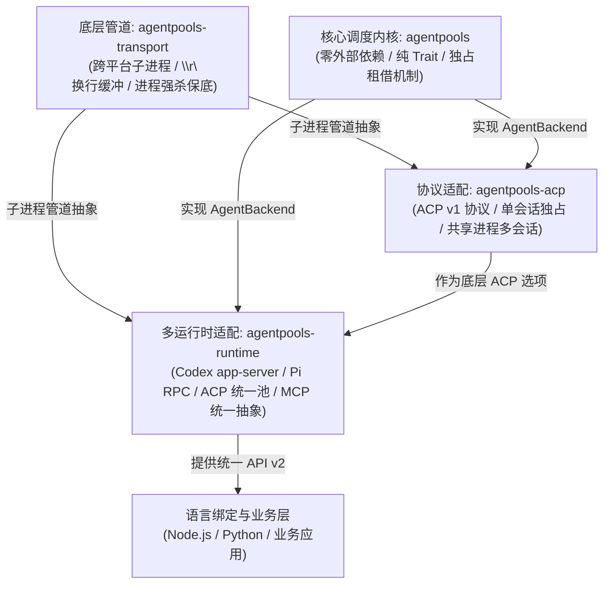

# `crates/` 扩展与适配模块导航

> 本目录包含了 `agentpools` 工作区的所有扩展子 crate。
>
> 核心调度器 [`agentpools`](../src/README.md) 保持**零外部依赖、零协议绑定**；而本目录下的 3 个 crate 负责向下解决跨平台子进程通信，向上接入具体的 Agent 协议生态与跨语言绑定。

---

## 1. 架构分层与依赖关系

---

## 2. 子模块速查与职责划分

| Crate | 文档入口 | 核心定位与解决的痛点 | 什么时候用它？ |
| --- | --- | --- | --- |
| **`agentpools-transport`** | [`README.md`](agentpools-transport/README.md) | **跨平台 stdio 进程与管道底座**。 解决 Windows `\r\n` 换行、非阻塞读取、流式事件乱序缓冲、Windows 退出假报错及僵尸进程强杀保底。 | 开发自定义底层 Agent 子进程适配器，需要健壮的跨平台管道管理时。 |
| **`agentpools-acp`** | [`README.md`](agentpools-acp/README.md) | **ACP v1 协议适配器**。 支持标准 ACP stdio 会话，提供“单进程独占会话”与“单进程多会话共享（`SharedAcpBackend`）”两种拓扑，支持可重试错误同会话恢复。 | 目标 Agent 原生支持 ACP 协议（如 Claude Code、Gemini Code Assist 等），或需要利用共享进程节省内存时。 |
| **`agentpools-runtime`** | [`README.md`](agentpools-runtime/README.md) | **多协议统一运行时与工具注入（API v2）**。 抹平 Codex app-server、Pi RPC 和 ACP 的报文差异；支持真正下发中断信号（`turn/interrupt`、`abort`）；提供统一的 MCP（Model Context Protocol）工具注入抽象。 | 在一个池中混合调度不同的 Agent，或为 Node.js / Python 语言绑定提供统一调度层时。 |

---

## 3. 设计原则

1. **单向依赖、严格分层**：
   - `agentpools-transport` 不依赖任何 Agent 协议或调度逻辑，纯粹作为 IPC 基础设施。
   - `agentpools-acp` 与 `agentpools-runtime` 作为兄弟模块，按需复用 `agentpools-transport` 的子进程管理能力。
2. **零胶水扩散**：
   - 厂商特有的 JSON 结构、私货参数、字段命名（驼峰 vs 下划线、数组 vs 字典）全部就地消化在对应的 crate 内部，绝不泄漏给外层业务代码。
3. **安全停机与资源保底**：
   - 所有的子 crate 均保证在取消与停机时有确定的清理流程，防止长期运行留下孤儿后台进程。
