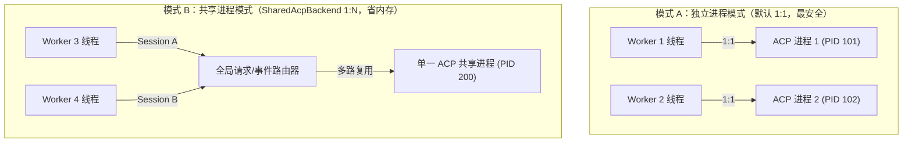

# `agentpools-acp` 协议适配器指南

> 这里是 `agentpools` 的标准 **Agent Client Protocol (ACP v1)** stdio 适配器。
>
> 专为支持 ACP 标准规范的 AI Agent（如 Claude Code、Gemini Code Assist、`@agentclientprotocol/codex-acp` 等）提供连接生命周期、进程拓扑管理、权限接管与多轮交互支持。

---

## 1. 核心架构与两种拓扑模式

ACP 适配器支持两种截然不同的进程管理拓扑，开发者可以根据资源与隔离性需求自由选择：



| 拓扑模式 | 适配器类型 | 内存与资源占用 | 崩溃隔离性 | 适用场景 |
| --- | --- | --- | --- | --- |
| **独立进程（默认）** | [`AcpBackend`](src/lib.rs) | 每个 Worker 独立启动一个子进程，消耗较多内存与启动时间。 | **极致隔离**。单个 Agent 崩溃、内存泄漏或卡死，绝对不影响其他 Worker。 | 生产环境、任务间需要强安全隔离、Agent 稳定性未知的场景。 |
| **共享进程** | [`SharedAcpBackend`](src/shared_process.rs) | 所有 Worker 共用同一个常驻 ACP 进程，大幅节省内存（实测约省 35%~50%）。 | **共享风险**。若底层单一进程异常退出，所有绑定的并发会话均会中断。 | Agent 自身支持多会话并发（如 Node.js ACP 服务）、本机资源紧张或频繁创建销毁会话的高吞吐场景。 |

---

## 2. 核心功能特性

### ① 零特权安全防护（`HostRequestHandler`）
- 默认情况下，适配器**不会向 Agent 自动授权任何文件读写或终端执行能力**。
- 若 Agent 发起权限请求（如询问“是否允许执行 bash 命令”），若未配置处理器，系统默认自动拒绝（安全第一）。
- 若需要授权，开发者只需实现 [`HostRequestHandler`](src/lib.rs) Trait：
  ```rust
  impl HostRequestHandler for MyHandler {
      fn handle(&self, method: &str, params: &Value) -> Result<Value, AcpError> {
          // 自行校验路径与安全权限
          Ok(json!({ "granted": true }))
      }
  }
  ```

### ② 会话智能容错与同会话重试
- 当 Agent 抛出远端业务报错（例如 API 429 限流、模型参数无效）时，由于底层 stdio 管道仍处于健康的同步状态，适配器允许在**同一个 Worker 的同一个 Session 上继续追问**，免去长达 10 秒的进程重启和会话握手开销。
- 只有发生管道断裂、超时或反序列化失败等致命异常时，才会丢弃旧会话。

### ③ 模型锁定与校验
- 支持通过 `AcpConfig.model` 指定目标模型。
- 会话建立后，适配器自动调用 `session/set_config_option` 并核对 Agent 返回的当前激活模型。若 Agent 不支持或回退到未授权的默认模型，会立即拦截报错，杜绝用错高价或劣质模型。

---

## 3. 快速上手示例

### ① 纯 Rust 启动独立池
```rust,ignore
use std::path::PathBuf;
use agentpools::{AgentPool, PoolConfig};
use agentpools_acp::{AcpBackend, AcpConfig};

let config = AcpConfig::new("node", "/path/to/project")
    .with_args(["./node_modules/@agentclientprotocol/codex-acp/dist/index.js"])
    .with_model("gpt-6-luna");

let pool = AgentPool::new(
    AcpBackend,
    config,
    PoolConfig { workers: 4, max_queued: 64 },
)?;

let mut lease = pool.acquire()?;
let reply = lease.ask("帮我审查当前目录下的代码质量。")?;
println!("Agent 回复: {}", reply.text);
lease.finish()?;
```

### ② 启用共享进程模式
```rust,ignore
use agentpools_acp::{AcpPoolOptions, AcpAgentOptions};

let options = AcpPoolOptions {
    api_version: 1,
    max_queued: 64,
    agents: vec![/* 配置相同的程序与参数 */],
};

// 一键构建共享进程池（所有会话复用同一个底层 Agent 进程）
let pool = options.build_shared()?;
```

---

## 4. 实战评测与报告生成（`batch_add` 示例）

代码库内置了完整的压力测试示例（4 个 Worker 并发解答 16 道算术题，挂载真实 MCP 工具并自动生成精美图表报告）：

### 1. 运行无需 Token 的本地 Mock 仿真
```bash
cargo build -p agentpools-acp --all-features --bins
cargo run -p agentpools-acp --example batch_add --all-features -- --mock
```
- 启动 4 个独立 Mock 进程，验证事件路由、并发独占与 MCP 加法器调用。
- 执行完毕后会自动在 `target/agentpools-batch-add/` 输出：
  - **`report.html`**：可直接在浏览器打开的交互式中文甘特图与时间线；
  - **`report.json`**：包含精确到毫秒的耗时、PID 分布与数值正确率统计。

### 2. 运行真实 Codex ACP 压力评测
```bash
# 设置本地已安装的 codex-acp 入口
$env:CODEX_ACP_ENTRY = 'C:\path\to\@agentclientprotocol\codex-acp\dist\index.js'

# 独立进程模式对比
cargo run -p agentpools-acp --example batch_add --all-features -- --codex

# 共享进程模式对比
cargo run -p agentpools-acp --example batch_add --all-features -- --codex-shared
```

---

## 5. 常见问题排查

- **Q: 为什么启动 Agent 时提示命令找不到？**  
  A: 请确保 `program` 传入的是可执行文件的确切路径或系统中已加入 `PATH` 的命令（在 Windows 上注意是 `.exe` 或 `.cmd`）。
- **Q: 为什么提示工作目录不存在？**  
  A: ACP 规范强制要求 `cwd` 必须是绝对路径，请勿传入相对路径。
