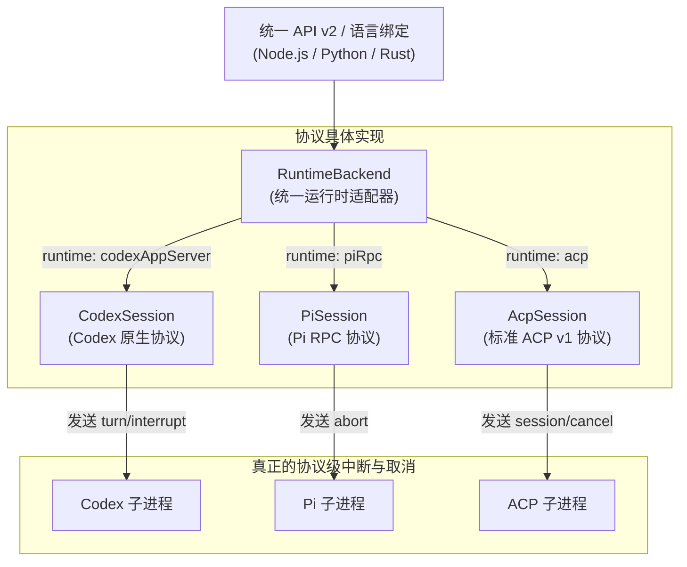

# `agentpools-runtime` 多协议统一适配器

> 这里是 `agentpools` 的多协议统一运行时层（API v2）。
>
> 核心调度器 `agentpools` 保持极致纯粹与协议无关，而本 crate 负责**抹平主流 Agent 协议之间的差异**——无论后端是基于标准 ACP、Codex 原生 app-server，还是 Pi RPC 协议，外部开发者均可通过一套统一的 API 和数据结构进行混合调度。

---

## 1. 架构总览与协议分发



---

## 2. 支持的运行时全貌

| 运行时标识 (`runtime`) | 协议类型 | 会话建立生命周期 | 交互协议 | 真实取消信号 |
| --- | --- | --- | --- | --- |
| **`codexAppServer`** | Codex 专用 JSON-RPC | `initialize` → `initialized` → `thread/start` | `turn/start` → `item/completed` → `turn/completed` | `turn/interrupt` |
| **`piRpc`** | Pi 原生 RPC (`--mode rpc`) | 启动检测 → `get_state` | `prompt` → `message_end` → `agent_settled` | `abort` |
| **`acp`** | 标准 ACP v1 stdio | `initialize` → `session/new` | `session/prompt` → 文本更新事件 | `session/cancel` |

底层跨平台的进程拉起、换行缓冲解析（CRLF/LF）与退出强杀保障由 [`agentpools-transport`](../agentpools-transport/README.md) 提供。

---

## 3. 核心统一抽象

### ① 统一数据模型
- **`RuntimePrompt`**：统一请求体，目前原生适配器统一接收纯文本问询（`RuntimePrompt::text("你好")`）。
- **`RuntimeResponse`**：统一应答结构 `{ text: String, stop_reason: String }`。
- **`RuntimeError`**：涵盖拉起失败、I/O 故障、协议异常、业务超时、协作取消以及 Agent 远端错误（`Remote`）。

### ② 统一 MCP（Model Context Protocol）工具注入
各厂商的工具注入协议存在客观差异：
- ACP 期望传 `mcpServers: [ { name, command, args, env: [{name, value}] } ]`；
- Codex app-server 期望传 `mcp_servers: { "server_name": { command, args, env: {k: v} } }`。

[`mcp.rs`](src/mcp.rs) 提供了统一的抽象：
```rust
use agentpools_runtime::{McpServer, NativeConfig};

// 1. 声明一个通用的 MCP 工具服务器
let sqlite_mcp = McpServer::stdio("sqlite", "uvx")
    .with_arg("mcp-server-sqlite")
    .with_env("SQLITE_PATH", "./app.db");

// 2. 挂载到 Codex 原生配置（底层自动转译为 Codex 的字典与 http_headers 格式）
let codex_config = NativeConfig::codex("codex", "/path/to/project")
    .with_arg("app-server")
    .with_mcp_server(sqlite_mcp);
```

### ③ 真正下发协议取消（真实防算力浪费）
传统的 Agent 调用取消往往只是客户端丢弃连接，后台进程依旧在全力跑模型与执行工具，极大浪费 GPU 资源和 Token 配额。  
`agentpools-runtime` 在收到取消信号后，会**向对应子进程发送真实的协议中断命令**（Codex 发送 `turn/interrupt`，Pi 发送 `abort`，ACP 发送 `session/cancel`），确保后台立即收敛停机。

---

## 4. API v2 跨语言配置指南（JSON / Node.js / Python）

无论是 Node.js、Python 还是纯 Rust，都可以通过一套 JSON 配置声明一个混合运行时池：

```json
{
  "apiVersion": 2,
  "maxQueued": 32,
  "agents": [
    {
      "runtime": "codexAppServer",
      "program": "codex",
      "args": ["app-server"],
      "cwd": "/absolute/path/project",
      "model": "gpt-6-luna",
      "mcpServers": [
        { "name": "sqlite", "command": "uvx", "args": ["mcp-server-sqlite"] }
      ]
    },
    {
      "runtime": "piRpc",
      "program": "pi",
      "args": ["--mode", "rpc", "--model", "gemini-2.5-flash"],
      "cwd": "/absolute/path/project"
    },
    {
      "runtime": "acp",
      "program": "npx",
      "args": ["-y", "@agentclientprotocol/codex-acp"],
      "cwd": "/absolute/path/project"
    }
  ]
}
```

- **索引对齐**：`pool.acquire(0)` 获取第一个 Codex Agent，`pool.acquire(1)` 获取第二个 Pi Agent。
- **混合调度**：不同运行时的 Worker 在同一个池中有序排队与并发，业务层无感。

---

## 5. 源码与测试

- **MCP 工具双向转译**：[`src/mcp.rs`](src/mcp.rs)
- **子进程与 JSON 通信包装**：[`src/process.rs`](src/process.rs)
- **多运行时集成测试**：[`tests/native.rs`](tests/native.rs)
