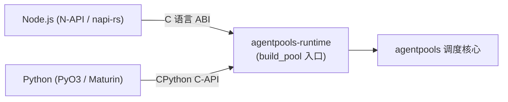

# 跨语言绑定规范与通信契约

> 本文档规范 Node.js 与 Python 绑定对 Rust 调度核心 [`agentpools`](../src/README.md) 的跨语言交互接口。
>
> 核心原则：**调度与状态机 100% 由底层 Rust 内核管理，脚本层仅负责做薄封装与原生异步类型映射，严禁在 JavaScript 或 Python 中自行重新发明调度算法。**

---

## 1. 架构与绑定技术栈



| 语言环境 | 绑定实现层 | 导出类型 | 异步范式 |
| --- | --- | --- | --- |
| **Node.js** | [`bindings/node`](../bindings/node/README.md) (`@napi-rs/cli`) | `AgentPool`, `SessionLease` | 原生 `Promise` / `async/await` |
| **Python** | [`bindings/python`](../bindings/python/README.md) (`pyo3` + `maturin`) | `AgentPool`, `SessionLease` | 原生 `asyncio` + `async with` 上下文管理器 |

---

## 2. API 版本与配置结构

### API v1（ACP 纯净版）
专用于标准 ACP 协议工作流：
```json
{
  "apiVersion": 1,
  "maxQueued": 128,
  "agents": [
    {
      "program": "codex-acp",
      "args": ["--stdio"],
      "env": { "KEY": "VAL" },
      "cwd": "C:/work/project",
      "mcpServers": [],
      "model": "gpt-6-luna",
      "timeouts": {
        "handshakeMs": 30000,
        "promptMs": 300000,
        "closeMs": 3000
      },
      "inheritStderr": false
    }
  ]
}
```

### API v2（多运行时混合模式，推荐）
每个 agent 额外包含 `runtime` 字段，支持同时混用 `codexAppServer`、`piRpc`、`acp`，并支持统一的 `mcpServers`。详细说明见[多运行时使用指南](multi-runtime-usage.md)。

---

## 3. 语言层交互契约

### ① 租借生命周期（Lease Lifecycle）
- **`acquire([targetIndex])`**：
  - 从池中借出一个 Worker；可不带参数（获取任意空闲 Worker），或传入索引（指定获取配置数组中第 N 个 Worker）。
  - 返回独占的 `lease` 凭据。
- **`lease.ask(prompt)`**：
  - 在当前独占会话上执行一轮请求，返回 `{ text: string, stopReason: string }`。
  - 同一个 lease 可以多次调用 `ask()`，历史上下文自动保留。
- **`lease.finish()`**：
  - 显式归还 Worker。归还前该 Worker 处于独占锁定状态，其它并发排队任务绝不插队。
  - Python 中通过 `async with lease:` 自动隐式调用 `finish()`。
- **`pool.close({ drain: true })`**：
  - 关闭池。`drain: true` 表示排队任务全部处理完毕后再退出。

### ② 错误映射规则
Rust 内部发生的错误在抛给高级语言时做统一映射：
- **`BuildError`** → 启动前配置校验失败（如工作目录不存在、命令为空），抛出语法/参数异常。
- **`AcquireError`** → 排队超限（超过 `maxQueued`）或队列已关闭，抛出资源占满异常。
- **`Remote` 错误** → Agent 远端错误（如 429 限流），此时调用方可捕获并在同一个 `lease` 上直接调用 `ask` 重试。
- **致命 I/O / 崩溃** → 抛出底层异常，Worker 会在下次调用时自动重建新会话。
