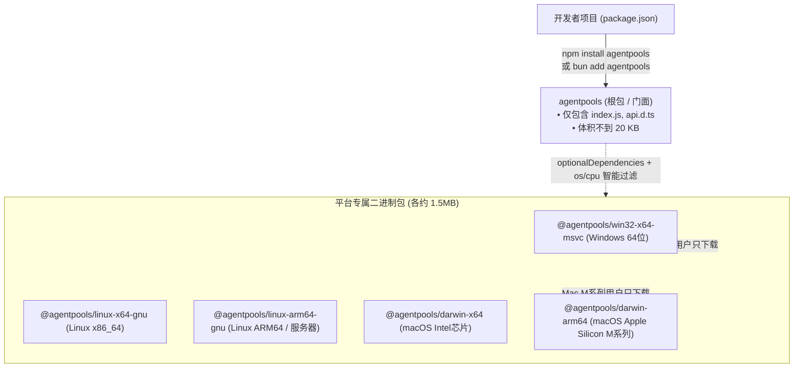
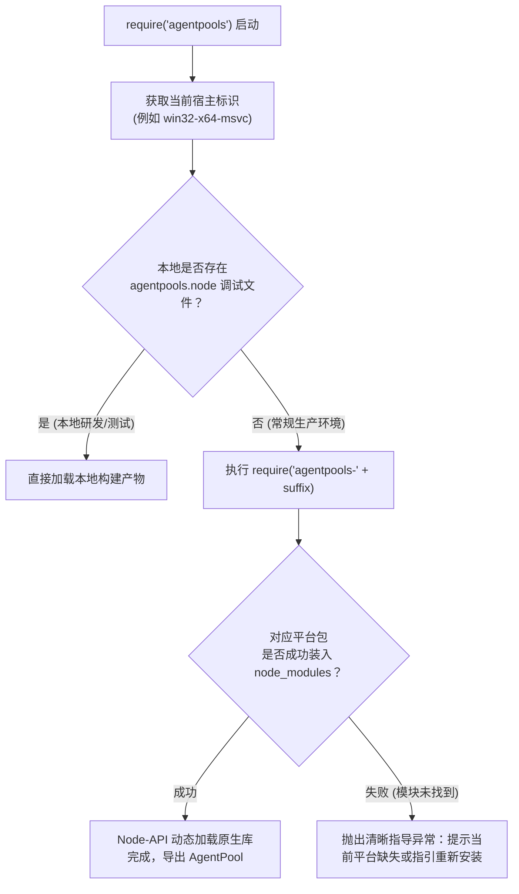

# npm 打包分发原理与跨平台使用指南（Node.js / Bun）

> 本文详细拆解 `agentpools` 在 npm 生态中的**多平台底层分发原理**，并提供在 **Node.js、TypeScript、Bun、pnpm** 等主流环境下的实战使用指南。

---

## 1. 核心解答：真的只需 `npm` 或 `bun` 安装即可吗？

**是的，完全正确！**

虽然底层核心由高性能 Rust 编写并直接编译为底层硬件机器码，但所有跨平台编译与打包的复杂度已经被我们和 GitHub Actions CI 流水线完全封装。

对最终开发者而言，体验与普通的纯 JavaScript 库**没有任何区别**：
- **无需安装 Rust 工具链**；
- **无需配置 C/C++ 编译器（MSVC/GCC/Clang）或 Python 编译环境**；
- **无需关心动态链接库的放置路径**；
- 敲下 `npm install agentpools` 或 `bun add agentpools`，即可在几毫秒内装好并直接调用。

---

## 2. 打包与分发原理深度剖析

为什么 `agentpools` 能做到“既有 Rust 原生机器码的强悍性能”，又有“纯 JS 库开箱即用”的体验？背后的核心设计如下：

### ① 门面架构（Facade Pattern）
在 npm 官方源上，`agentpools` 实际上由 **1 个根包 + 5 个硬件平台特定包** 协同构成：



### ② `optionalDependencies` 与 `os` / `cpu` 智能过滤机制
在根包 `agentpools` 的 `package.json` 中，5 个平台包被声明在 `optionalDependencies` 中：
```json
{
  "name": "agentpools",
  "optionalDependencies": {
    "agentpools-win32-x64-msvc": "0.1.0",
    "agentpools-linux-x64-gnu": "0.1.0",
    "agentpools-linux-arm64-gnu": "0.1.0",
    "agentpools-darwin-x64": "0.1.0",
    "agentpools-darwin-arm64": "0.1.0"
  }
}
```
而在各个平台包自身的 `package.json` 中，均声明了严格的运行环境要求，例如 [`npm/win32-x64-msvc/package.json`](file:///d:/project/rust/agentpools/bindings/node/npm/win32-x64-msvc/package.json)：
```json
{
  "name": "agentpools-win32-x64-msvc",
  "os": ["win32"],
  "cpu": ["x64"],
  "main": "agentpools.win32-x64-msvc.node"
}
```

**包管理器的工作过程**：
1. 当开发者在 Windows 电脑上运行 `npm i agentpools` 或 `bun add agentpools` 时；
2. 包管理器检测到宿主是 `os: win32`、`cpu: x64`；
3. **只下载并解压** `agentpools-win32-x64-msvc`；
4. 对于另外 4 个不符合条件的平台包，包管理器将其识别为“可选依赖且架构不匹配”，**安全、静默地跳过下载**，绝不报错；
5. **体积优势**：用户电脑里只会存在一份约 1.5MB 的对应系统动态库，而不需要把其它平台的二进制一股脑下载下来。

### ③ 运行时的动态加载链路（`index.js`）
当你在代码中执行 `const { AgentPool } = require('agentpools')` 时，根包入口 [`index.js`](file:///d:/project/rust/agentpools/bindings/node/index.js) 启动以下加载逻辑：



由于底层基于 **Node-API (N-API v8+)** 工业级稳定接口规范，一次编译出来的二进制动态库，在 Node.js 20、Node.js 22、Node.js 24 以及 **Bun** 环境下均具有完全向前兼容的二进制 ABI，无需为各个 Node 次版本重新编译！

---

## 3. 多包管理器安装指南

无论是哪种现代包管理器，均能自动识别 `optionalDependencies` 的平台过滤机制：

### npm
```bash
npm install agentpools
```

### Bun（完全原生支持）
> [!TIP]
> Bun 内部完整实现了 Node-API（`.node` 模块加载）规范和 npm 平台的 `os`/`cpu` 过滤机制，完全原生支持 `agentpools`，无需任何 polyfill 或兼容层。
```bash
bun add agentpools
```

### pnpm
```bash
pnpm add agentpools
```

### Yarn
```bash
yarn add agentpools
```

---

## 4. 实际使用代码示例

### ① CommonJS 规范（Node.js / Bun）
```javascript
const { AgentPool } = require('agentpools');

async function run() {
  // 创建一个池，配置一个 Codex 原生 app-server Worker
  const pool = new AgentPool({
    apiVersion: 2,
    maxQueued: 32,
    agents: [
      {
        runtime: 'codexAppServer',
        program: 'codex',
        args: ['app-server'],
        cwd: process.cwd(),
      },
    ],
  });

  try {
    // 独占租借 Worker 槽位
    const lease = await pool.acquire();
    try {
      // 第一轮问答
      const res1 = await lease.ask('请解释什么是 CAP 定理。');
      console.log('第一轮回复:', res1.text);

      // 第二轮追问：上下文在同一进程/会话中完整保持
      const res2 = await lease.ask('在分布式数据库中，如何权衡 CP 和 AP？');
      console.log('追问回复:', res2.text);
    } finally {
      // 归还租借（ Worker 可以被下一个任务复用）
      await lease.finish();
    }
  } finally {
    // 优雅关闭池
    await pool.close({ drain: true });
  }
}

run().catch(console.error);
```

### ② ES Module 与 TypeScript（Node.js / Bun）
`agentpools` 内置了完整的 [`api.d.ts`](file:///d:/project/rust/agentpools/bindings/node/api.d.ts) 类型声明，享受智能感知与代码补全：

```typescript
import { AgentPool, type AgentResponse, type MultiRuntimePoolOptions } from 'agentpools';

const config: MultiRuntimePoolOptions = {
  apiVersion: 2,
  sharedProcess: true, // 开启单进程多会话复用（极其节省内存与冷启动）
  agents: [
    {
      runtime: 'codexAppServer',
      program: 'codex',
      args: ['app-server'],
      cwd: process.cwd(),
      ephemeral: true,   // 开启阅后即焚（会话结束后清理临时文件）
    },
    {
      runtime: 'piRpc',
      program: 'pi',
      args: ['--mode', 'rpc', '--model', 'gemini-2.5-flash'],
      cwd: process.cwd(),
    },
    {
      runtime: 'acp',
      program: 'npx',
      args: ['-y', '@agentclientprotocol/codex-acp'],
      cwd: process.cwd(),
    },
  ],
};

const pool = new AgentPool(config);

// 在 Bun 中运行：直接 bun run index.ts，无需编译为 js
async function askWorker(index: number, question: string): Promise<AgentResponse> {
  const lease = await pool.acquire(index);
  try {
    return await lease.ask(question);
  } finally {
    await lease.finish();
  }
}
```

---

## 5. 生产与容器部署避坑指南（FAQ）

### Q1: 在 Docker 容器中部署需要安装 Rust 或 GCC 吗？
**答：完全不需要！**  
只要你的 Dockerfile 基础镜像是主流 Linux 发行版（如 `node:22-bookworm`、`node:22-slim`、`debian:12`、`ubuntu:24.04` 等基于 glibc 的环境）：
```dockerfile
FROM node:22-slim

WORKDIR /app
COPY package*.json ./

# 这里 npm 会自动匹配并下载 @agentpools/linux-x64-gnu，秒级完成
RUN npm ci --omit=dev

COPY . .
CMD ["node", "index.js"]
```

### Q2: Alpine Linux（musl libc）是否支持？
**答**：由于 Alpine 使用的是 musl libc 而非标准 glibc，如果直接在 Alpine 下运行针对 glibc 编译的二进制，可能会提示找不到 libc。  
**建议**：在容器化部署生产环境中，推荐使用 Debian / Ubuntu 系的轻量镜像（如 `node:22-slim` 或 `oven/bun:slim`），既享受仅几十 MB 的轻量镜像体积，又能完美免编译直装运行。

### Q3: 团队内网私有 npm 镜像源（如 Verdaccio / Nexus）如何同步？
**答**：如果团队搭建了内网 npm 私有镜像源，必须确保同步了根包以及对应的硬件包：
- `agentpools`
- `agentpools-win32-x64-msvc`（若团队包含 Windows 开发者）
- `agentpools-darwin-arm64`（若团队包含 Mac M 系列开发者）
- `agentpools-linux-x64-gnu`（CI 与 Linux 生产服务器必须）
只要内网源完整代理了 npm 官方 registry，包管理器就会自动解析拉取对应平台包。
