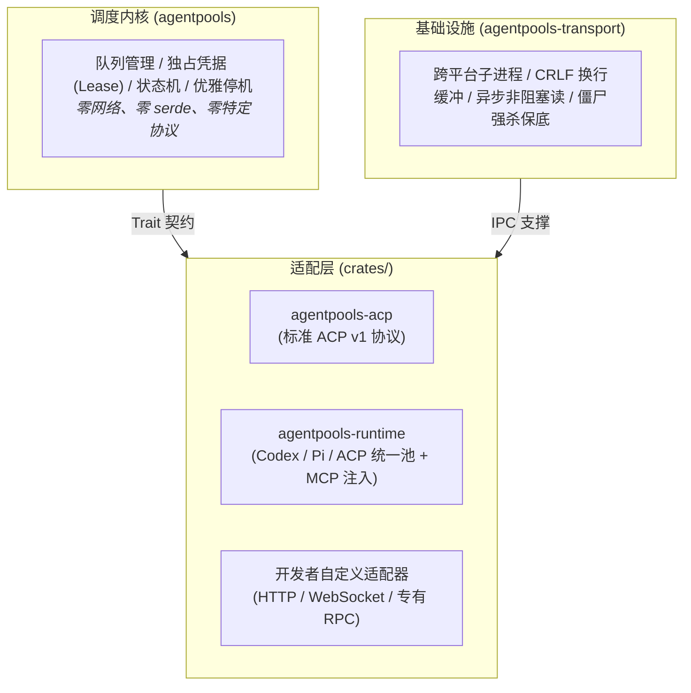

# 多运行时接入与架构设计指南

> 本文档阐述 `agentpools` 的多协议扩展架构与边界划分原则，指导如何在保持调度内核纯粹的前提下，接入并混合调度各种异构 Agent。

---

## 1. 架构分工与边界哲学

在设计多 Agent 调度系统时，我们遵循一条根本原则：**“调度内核做减法，协议适配做收敛”**。



| 层次 | 所在模块 | 负责的事情 | 严禁触碰的事情 |
| --- | --- | --- | --- |
| **调度核心** | [`agentpools`](../src/README.md) | 线程池管理、等待队列、Worker 租借独占、生命周期追踪。 | 严禁依赖任何具体的 JSON 字段、模型名称或网络协议。 |
| **管道底座** | [`agentpools-transport`](../crates/agentpools-transport/README.md) | 跨平台子进程启动、换行分词、非阻塞管道读取、退出强杀。 | 不处理具体的 Agent 协议语义，只做通用的字节与行流转发。 |
| **协议适配** | [`agentpools-acp`](../crates/agentpools-acp/README.md) / [`runtime`](../crates/agentpools-runtime/README.md) | 握手握手包组装、事件解析、真实信号下发、工具（MCP）转译。 | 不自行实现一套独立的排队与调度算法。 |

---

## 2. 适配器必须恪守的 4 大法则

任何要接入 `agentpools` 的协议适配器，必须实现 [`AgentBackend`](../src/backend.rs) 与 [`AgentSession`](../src/backend.rs)，并严格遵守以下契约：

### 法则 ①：独占性生命周期（Lease 期间不可插队）
- `AgentBackend::open()` 负责打开一个全新的 Agent 会话。
- 一旦会话被交付给 [`SessionLease`](../src/lease.rs)，直到调用方调用 `finish()` 归还前，**该 Worker 槽位绝对归该租用独占**。
- 中间的业务多轮交互、外部单元测试验证、沙箱校验期间，调度器绝不允许任何其他并发请求抢占该会话。

### 法则 ②：真实协议取消（杜绝无效 Token 消耗）
- 外部触发取消时（如用户点击网页的“停止生成”或协作超时），适配器**不能仅仅在客户端单方面标记中断**。
- 必须通过底层通信信道向 Agent 子进程发送真实的协议中断指令：
  - 对 Codex：下发 `turn/interrupt`；
  - 对 Pi：下发 `abort`；
  - 对 ACP：下发 `session/cancel`。
- 确保后台的模型推理或工具调用立刻终止，避免持续浪费企业的高昂算力与 Token。

### 法则 ③：精准的状态容错（`can_retry_after`）
- 当一次请求发生错误时，适配器必须在 `can_retry_after` 中明确表态：**当前会话是否依然健康同步？**
  - **返回 `true`（可重试）**：例如远端返回 HTTP 429 限流、单次 Prompt 参数校验失败。底层管道连接未断，会话状态完好，允许在当前 Session 继续追问。
  - **返回 `false`（不可重试）**：如网络断开、子进程崩溃、协议乱序。调度器将强制关闭旧会话并释放资源，但**保留该 Worker 的独占所有权**，下一次调用会自动冷启动新会话，防止调用方被插队。

### 法则 ④：安全停机与资源保底
- 必须支持双模式停机：
  - **`Drain`**：等待所有已排队的请求处理完毕再退出；
  - **`CancelPending`**：清空等待队列，但允许正在执行的活跃请求体面完成。
- 子进程超时未自然退出时，必须执行强制终止（Kill）并回收 Reader 线程句柄，杜绝僵尸进程泄漏。

---

## 3. 工具注入（MCP）的统一机制

在传统设计中，各个 Agent 的工具注入方式截然不同（ACP 采用数组格式，Codex 采用字典映射，且 Header 命名各不相同）。  
`agentpools-runtime` 的做法是：**在适配层设立统一的 [`McpServer`](../crates/agentpools-runtime/src/mcp.rs) 抽象**。

- 无论前端传入何种风格的配置，解析器自动宽容归一化；
- 在会话启动阶段，适配器负责将其分别转译为：
  - ACP 的 `session/new.params.mcpServers` 数组；
  - Codex 的 `thread/start.params.config.mcp_servers` 字典。
- 业务代码不需要写任何特定厂商的转换补丁。

---

## 4. 如何接入一个新的 Agent 运行时？

如果你想接入一个专有的 Agent（例如内部 HTTP 接口的大模型 Agent）：

1. **定义会话结构体**：
   ```rust,ignore
   pub struct MyAgentSession {
       client: reqwest::Client,
       session_id: String,
   }
   ```
2. **实现 `AgentSession` Trait**：
   实现 `run()`、`close()` 以及 `can_retry_after()`。
3. **实现 `AgentBackend` Trait**：
   实现 `open(&self, config) -> Result<MyAgentSession, MyError>`。
4. **接入池**：
   ```rust,ignore
   let pool = AgentPool::new(MyBackend, my_config, PoolConfig::default())?;
   ```
   即可立刻享受完整的排队、并发控制、独占租用和取消能力。
