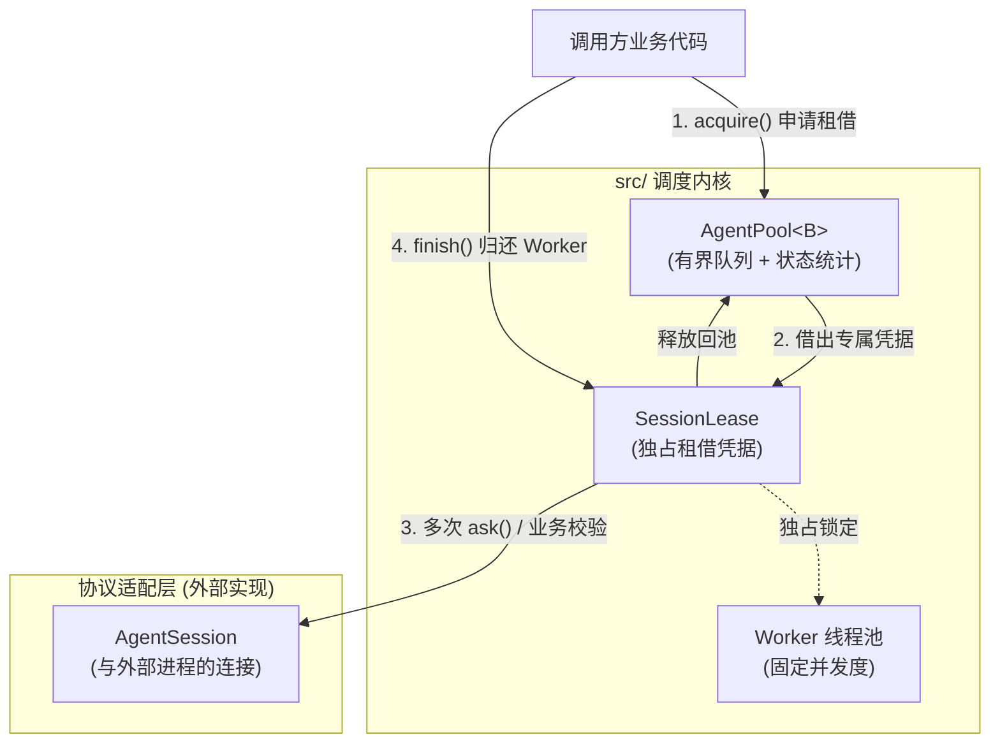

# `src/` 调度内核源码指南

> 这里是 `agentpools` 纯 Rust 调度引擎的所在地。
> 
> **零外部依赖、零特定协议捆绑**。本模块不关心底层是 ACP、Codex 还是 Pi，只专注解决核心调度问题：**为冷启动极慢、交互周期极长的 AI Agent 提供独占租借（Exclusive Lease）、跨请求上下文保留与安全生命周期管理。**

---

## 1. 架构总览与流转

调度内核的核心对象关系如下：



---

## 2. 源码模块地图

调度引擎代码仅千行左右，按职责拆分为以下 6 个文件：

| 模块 | 源码文件 | 核心职责 | 重点关注类型 |
| --- | --- | --- | --- |
| **对外统一出口** | [`lib.rs`](lib.rs) | 组织内部模块并重导出公共 API，定义统一入口。 | `agentpools::*` |
| **抽象契约** | [`backend.rs`](backend.rs) | 定义后端会话契约，**将调度与协议解耦**。 | [`AgentBackend`](backend.rs), [`AgentSession`](backend.rs) |
| **协作取消** | [`cancellation.rs`](cancellation.rs) | 跨线程/跨任务传递协作式取消信号。 | [`CancellationToken`](cancellation.rs) |
| **独占租借** | [`lease.rs`](lease.rs) | 实现租借句柄与排队凭据，控制独占周期的开启与释放。 | [`SessionLease`](lease.rs), [`LeaseHandle`](lease.rs) |
| **调度队列** | [`pool.rs`](pool.rs) | 实现有界等待队列、工作线程循环、状态维护与优雅停机。 | [`AgentPool`](pool.rs), [`PoolConfig`](pool.rs) |
| **错误分类** | [`error.rs`](error.rs) | 严格区分建池阶段、获取租用阶段和会话调用阶段的错误。 | [`BuildError`](error.rs), [`AcquireError`](error.rs), [`TaskError`](error.rs) |

---

## 3. 必须理解的 3 个核心设计

### ① 为什么是“租借（Lease）”而不是传统的“提交任务（Submit Task）”？
普通的线程池通常是 `pool.execute(|| { ... })` 一次性执行完毕即结束。但 **Agent 对话是连续多轮的**：
- 第一轮提问：“请帮我写一个快速排序”；
- 外部校验：调用方在本地运行编译器或测试套件，检查代码正确性（耗时可能数秒）；
- 第二轮追问：“编译报错了，请看这个错误信息并修复”。

如果用普通线程池，中间校验期间 Agent 进程可能被其他并发请求抢走，导致多轮上下文彻底混乱。  
**在 `agentpools` 中：** 调用方获得 [`SessionLease`](lease.rs) 后，该 Worker 在调用 `finish()` 之前**绝对独占**。无论是连续发多次 `ask()` 还是在中间停顿做耗时业务校验，任何其他任务都无法插队。

### ② 极致的锁粒度（Fine-grained Locking）
- 队列内部的 `Mutex<Queue>` **仅用于保护极短瞬间的入队、出队和计数器更新**。
- Worker 取出任务后，在执行长达数分钟的 LLM 流式交互和调用方校验时，**完全不持有队列锁**。
- 这保证了即使某些 Worker 正在执行超长时间的复杂任务，其他 Worker 的调度与新请求排队依然完全非阻塞、零延迟。

### ③ Worker 与 Session 的解耦容错（`can_retry_after`）
- **Worker**：池内部固定的工作线程槽位。
- **Session**：与底层子进程或网络通道建立的协议会话。

当一次 `ask` 报错时，系统不会鲁莽地重启进程，而是询问 [`AgentSession::can_retry_after`](backend.rs)：
- **可恢复错误（返回 `true`，如模型限流或参数无效）**：保持底层会话与子进程连接不中断，复用原会话继续下一次问询，省下数十秒的冷启动开销。
- **不可恢复错误（返回 `false`，如进程崩溃、管道断开）**：丢弃旧会话；但此时**该 Worker 仍归当前租用独占**，下一次 `ask` 会在此 Worker 上自动冷启动打开全新会话，保证调用方重试时依然不会被其他任务插队抢占。

---

## 4. 典型使用代码与生命周期

```rust,ignore
use agentpools::{AgentPool, PoolConfig, ShutdownMode};

// 1. 初始化池（4 个常驻 Worker，最多允许 128 个排队请求）
let mut pool = AgentPool::new(
    backend,
    session_config,
    PoolConfig { workers: 4, max_queued: 128 },
)?;

// 2. 获取独占租借凭据（排队获取或立即获取）
let mut lease = pool.acquire()?;

// 3. 多轮交互与外部业务反馈
let mut response = lease.ask(initial_prompt)?;
while let Some(feedback) = validate_in_sandbox(&response) {
    // 依然在同一个 Agent 会话与上下文中追问
    response = lease.ask(feedback)?;
}

// 4. 显式完成并释放 Worker 回池
lease.finish()?;

// 5. 优雅停机（等待排队请求处理完毕后退出）
let report = pool.shutdown(ShutdownMode::Drain);
```

---

## 5. 延伸阅读与测试

- **底层 IPC 进程通道**：了解子进程如何安全拉起、换行缓冲与退出保底强杀，见 [`agentpools-transport`](../crates/agentpools-transport/README.md)。
- **真实 Agent 协议接入**：
  - ACP 协议适配器：[`agentpools-acp`](../crates/agentpools-acp/README.md)
  - Codex / Pi / 多协议统一适配器：[`agentpools-runtime`](../crates/agentpools-runtime/README.md)
- **调度单元与集成测试**：
  - 查看纯调度独占与并发测试：[`tests/pool.rs`](../tests/pool.rs)
  - 查看全生命周期端到端测试：[`crates/agentpools-runtime/tests/native.rs`](../crates/agentpools-runtime/tests/native.rs)
